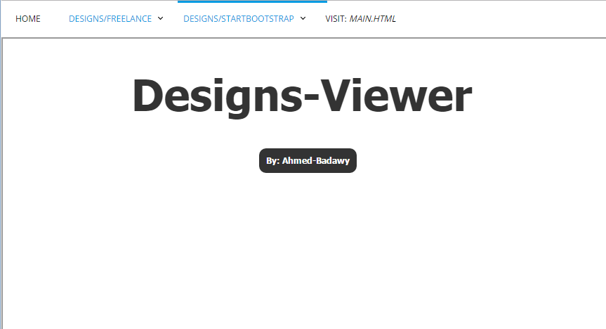

# Designs-Viewer
#### this is a very simple way to automatically show users & clients your designs. 
#### you dont' have to understand anything about php. just put your designs inside a folder in (./designs/) directory. 

- the folder name will work as a : menu list name
- the design-folder name will work as a : menu item

##### Link:  [Here's a Live Demo](http://ahmed-badawy.com/projects/Designs-Viewer/)
##### Link:  [Github Repo](https://github.com/Ahmed-Badawy/Designs-Viewer)

---

### there is another thing: same idea implies to external websites that allow this.
(notice that: many websites don't allow putting their website inside an iframe)

##### Link:  [Design-Viewer (external websites)](http://ahmed-badawy.com/projects/Designs-Viewer/websites.php)

you can populate this with the websites of your needs. just edit the array in the begining of the file (websites.php)
you will find the code in the same repo...

